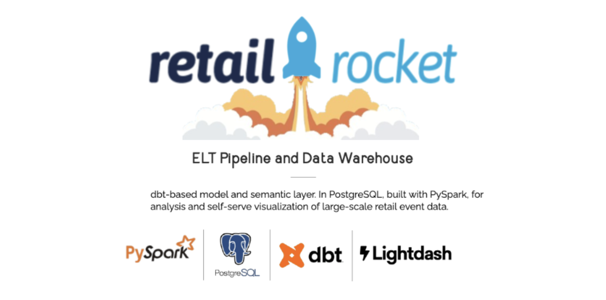
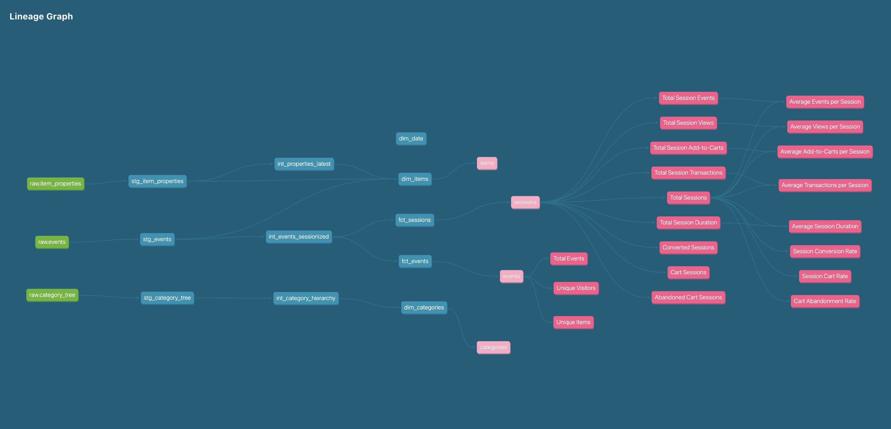
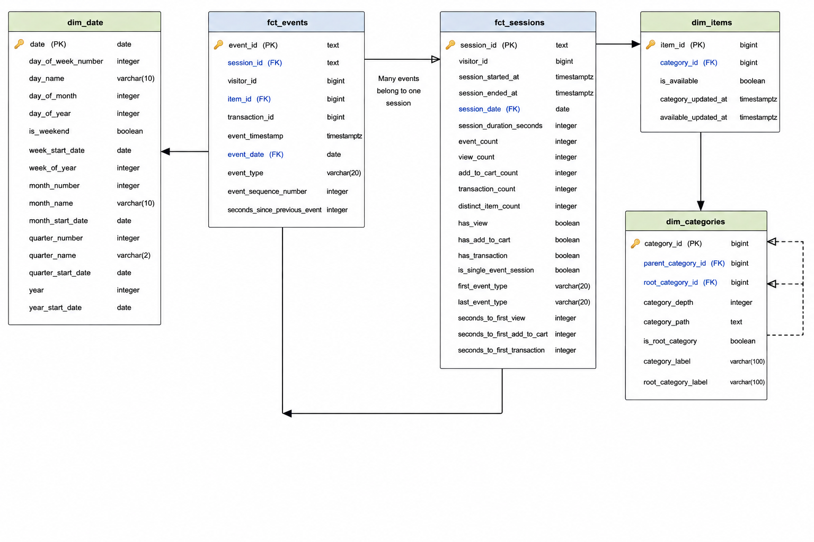
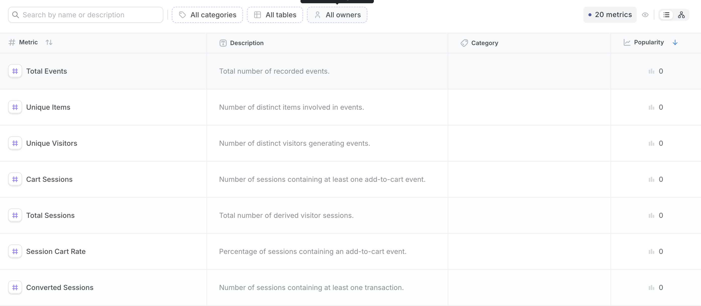
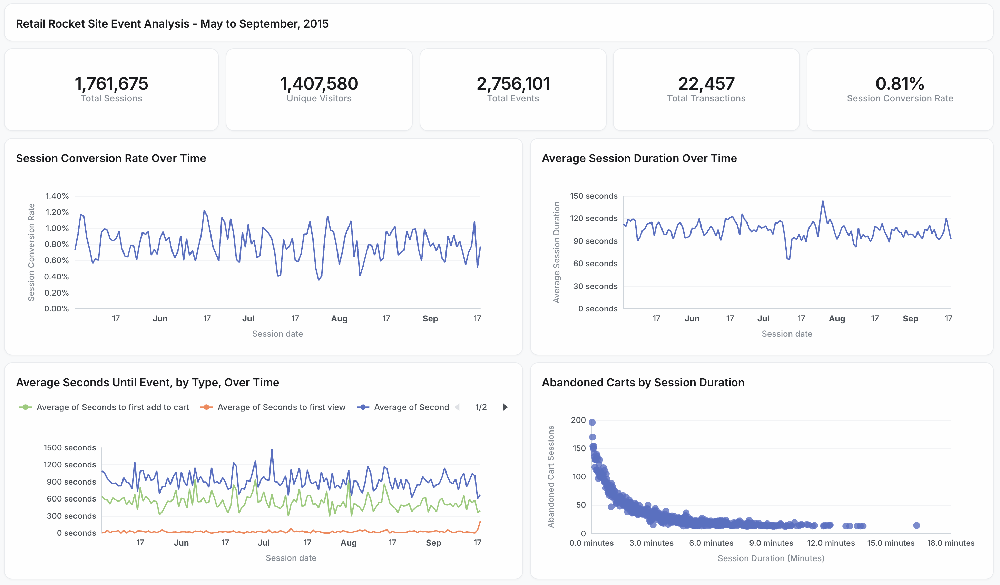

# Retail Rocket Event Data - ELT Pipeline and Data Warehouse

An ELT pipeline and dimensional data warehouse for analyzing Retail Rocket event data. Implements PySpark for ingestion, dbt for data transformation and dimensional modeling in PostgreSQL, and Lightdash as a self-serve BI layer for exploring governed dimensions, joins, and metrics.


## Table of Contents
- [Overview](#overview)
- [Architecture](#architecture)
- [Pipeline Overview](#pipeline-overview)
- [Analytics Outputs](#analytics-outputs)
- [Getting Started](#getting-started)


## Overview
The Retail Rocket dataset is one of the largest publicly available e-commerce event datasets, containing data on over 1 million site visitors, 2 million site events, and 20 million product properties from May to September of 2015. This project builds a containerized pipeline that:

- Ingests raw `.csv` files with PySpark.
- Models data into a galaxy schema with dbt.
- Defines a semantic layer for governed joins and metrics.
- Tests and logs all pipeline steps from ingestion to visualization.

## Architecture
### Model and Metric Lineage


### Galaxy Schema


### Metric Definitions


## Pipeline Overview

Data moves through four stages: PySpark loads the raw CSV files into PostgreSQL, dbt reshapes them into a galaxy schema, a MetricFlow semantic layer defines governed metrics on top of the marts, and Lightdash exposes those metrics for exploration. Tests run inside each stage.

### Ingestion

`ingestion/src/ingest.py` orchestrates the load. Each dataset is read, validated, and only then written to PostgreSQL, so malformed source data fails before it reaches the warehouse:

```python
events = read_events(spark)
category_tree = read_category_tree(spark)
item_properties = read_item_properties(spark)

validate_events(events)
validate_category_tree(category_tree)
validate_item_properties(item_properties)

ensure_raw_schema_exists()
write_to_postgres(events, "events", "overwrite")
```

In reading, every file is parsed against an explicit Spark schema in `FAILFAST` mode, so a value that does not match its declared type raises immediately instead of silently becoming null:

```python
spark.read
    .option("header", True)
    .option("mode", "FAILFAST")
    .schema(EVENTS_SCHEMA)
    .csv(f"{RAW_DATA_DIR}/events.csv")
```

The validators in `ingestion/src/validation.py` then check the contract each dataset must satisfy: the source file exists, the required columns are present, and the columns that later become keys or define grain contain no nulls.

These validators are tested with pytest. Each test builds a small in-memory DataFrame from a session-scoped Spark fixture and asserts both directions, so a valid row passes and a row with a null `visitorid` raises `ValueError`.

### Staging

Staging models are views in `analytics_staging`. They apply no business logic beyond renaming source columns to snake_case and converting the Retail Rocket epoch-millisecond timestamps into real timestamps:

```sql
select
    to_timestamp(timestamp / 1000.0) as event_timestamp,
    visitorid as visitor_id,
    event as event_type,
    itemid as item_id,
    transactionid as transaction_id
from {{ source('raw', 'events') }}
```

`dbt build` runs the schema tests declared in `stg_schema.yml` as each model is created, so a failed timestamp conversion or a missing key surfaces here instead of in the marts.

### Intermediate

Intermediate models are materialized as views in `analytics_intermediate` and hold the reusable logic that the marts assemble. Sessions are not given, so are derived in `int_events_sessionized`: each visitor's events are ordered, and any gap longer than 30 minutes starts a new session.

```sql
case
    when previous_event_timestamp is null then 1
    when (event_timestamp - previous_event_timestamp) > interval '30 minutes' then 1
    else 0
end as is_new_session
```

A running sum over that flag numbers each visitor's sessions, and `dbt_utils.generate_surrogate_key` hashes the visitor and session number into a stable `session_id`.

`int_properties_latest` narrows the item property change log to the `categoryid` and `available` properties, then ranks each item's snapshots by recency and keeps only the current value. `int_category_hierarchy` uses a recursive CTE to descend from the root categories, producing `root_category_id`, `category_depth`, and a readable `category_path` for each node.

### Marts

Marts are materialized as tables in `analytics_marts` and form the galaxy schema shown in [Architecture](#architecture).

`fct_events` is one row per event, keyed by a surrogate `event_id`. `fct_sessions` collapses the `int_events_sessionized` model into one row per session, precomputing the counts, flags, and timings that the metrics build on:

```sql
count(*) filter (where event_type = 'view') as view_count,
count(*) filter (where event_type = 'addtocart') as add_to_cart_count,
count(*) filter (where event_type = 'transaction') as transaction_count,

bool_or(event_type = 'transaction') as has_transaction,
```

Testing is heaviest at this layer. Every primary key carries `not_null` and `unique`, and the derived counts and flags carry `not_null`, so an aggregation that silently drops rows fails the build rather than reaching a dashboard.

### Semantic layer

Four semantic models in `dbt/models/semantic/` sit on top of the marts and declare the shared entities (`event`, `session`, `visitor`, `item`, and `category`), dimensions, and measures. Metrics are defined once here instead of inside individual Lightdash charts, keeping a definition like conversion identical across every chart that uses it:

```yaml
- name: session_conversion_rate
  label: Session Conversion Rate
  description: Percentage of sessions containing at least one transaction.
  type: ratio
  type_params:
    numerator:
      name: total_sessions
      filter: |
        {{ Dimension('session__has_transaction') }} = true
    denominator: total_sessions
```

`lightdash deploy` publishes these models as explores, so the metric definitions under version control are the ones available in the BI layer.

## Analytics Outputs
### An Example Lightdash Dashboard



### Key Insights

Across May–September 2015, the site recorded **1.76M sessions**, **1.41M unique visitors**, and **2.76M events**, but only **22.5K transactions** — a session conversion rate of **0.81%**.

Looking at average session durations and the session duration vs. abandoned carts scatter plot, a lever to drive conversion becomes apparent: increasing session duration. The scatter plot shows an overwhelming majority of abandoned cart sessions have durations below 3 minutes. Extending sessions beyond this threshold may be a worthwhile initiative.

## Getting Started

### Prerequisites

- Python 3.12
- Java 17 or later
- Docker Desktop
- The Lightdash CLI, installed using the [official instructions](https://docs.lightdash.com/get-started/setup-lightdash/get-project-lightdash-ready)

The commands below use a POSIX shell. On Windows, run them from WSL or use the equivalent PowerShell commands.

### 1. Configure local services

From the repository root, create your local environment file and update the placeholder values. Set `LIGHTDASH_SECRET` to a long, randomly generated value.
```bash
cp .env.example .env
docker compose up -d
```

Wait until the PostgreSQL and Lightdash containers are running:

```bash
docker compose ps
```

### 2. Download the source data

Download the Retail Rocket CSV files from [Kaggle](https://www.kaggle.com/datasets/retailrocket/ecommerce-dataset/data) and place these files in `data/raw/`:

```text
events.csv
category_tree.csv
item_properties_part1.csv
item_properties_part2.csv
```

The source data is intentionally excluded from version control.

### 3. Install Python dependencies

```bash
python3.12 -m venv .venv
source .venv/bin/activate
pip install -r requirements.txt
```

### 4. Configure dbt

Create `~/.dbt/profiles.yml` if it does not exist, then add the following profile. Update the connection values if they differ from your `.env` file:

```yaml
retail_rocket_analytics:
  outputs:
    dev:
      type: postgres
      host: localhost
      port: 5432
      user: username
      pass: password
      dbname: analytics_events
      schema: analytics
      threads: 16
      sslmode: disable
  target: dev
```

Verify the connection before running the pipeline:

```bash
cd dbt
dbt deps
dbt debug
cd ..
```

### 5. Test ingestion validation

Run the ingestion validation tests from the repository root:

```bash
PYTHONPATH=ingestion/src pytest -v ingestion/tests/test_validation.py
```

### 6. Ingest and transform the data

Run the ingestion command from the repository root so its relative data path resolves correctly:

```bash
python ingestion/src/ingest.py
cd dbt
dbt build
```

### 7. Deploy to Lightdash

Open [http://localhost:8081](http://localhost:8081), create an account, and create a project. Choose PostgreSQL as the warehouse and select the CLI connection option. Run the generated `lightdash login` command from the `dbt/` directory, then deploy:

```bash
lightdash deploy --create
```

In lightdash project settings (advanced), configure the warehouse connection with:

- Host: `db`
- Port: `5432`
- Database, username, and password: the matching `POSTGRES_*` values from `.env`

`db` works here because Lightdash and PostgreSQL are on the same Docker Compose network. Use `localhost` only for tools running directly on your host machine.


